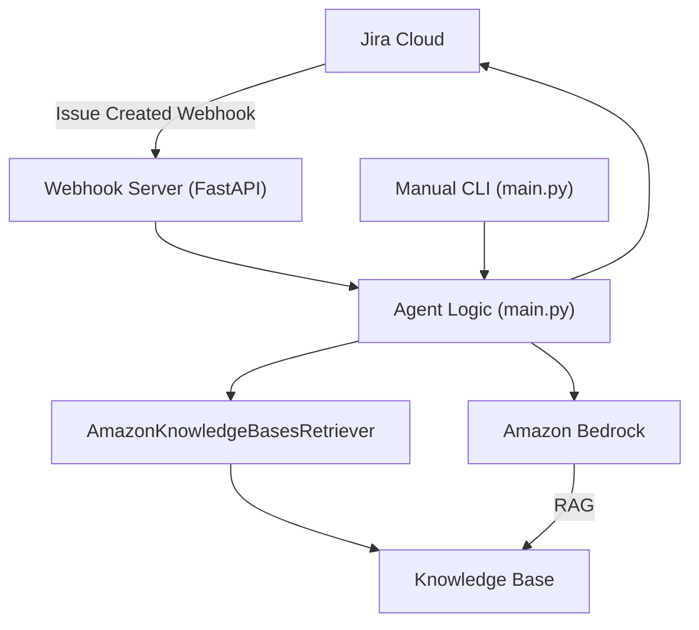
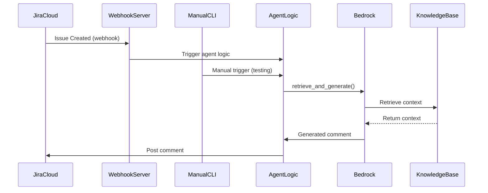

### Start the Webhook Server Locally

To start the webhook server locally for development/testing:

```bash
uvicorn webhook_server:app --host 0.0.0.0 --port 8000
```

You can access the FastAPI docs at: http://localhost:8000/docs

### Manually Test the Webhook Endpoint

You can manually test the webhook endpoint using curl:

```bash
curl -X POST http://localhost:8000/webhook/jira \
  -H "Content-Type: application/json" \
  -d '{"issue": {"key": "ABC-123"}, "webhookEvent": "jira:issue_created"}'
```

You should receive a JSON response indicating the request was accepted.
# JiraBot: Bedrock RAG-Powered JIRA Comment Assistant


## Overview
JiraBot is automatically triggered by Jira webhooks when a new ticket is created. The webhook server receives the event, runs the agent logic (main.py), and posts a generated comment to the ticket.

**Agent Logic (main.py) is used in two ways:**
- **Automation:** Invoked by the webhook server for production ticket processing.
- **Manual/Testing:** Can be run directly from the CLI for development and testing.

JiraBot leverages AWS Bedrock, a unified knowledge base (RAG), and JIRA APIs to generate high-quality, context-aware comments for JIRA tickets. It integrates data from Confluence, JIRA, GitHub, and S3, using vector search and LLMs for retrieval-augmented generation.

## Features
- Unified knowledge base (vector DB) with Wiki, JIRA, GitHub, and S3 sources
- Retrieval-augmented generation (RAG) using AWS Bedrock
- Automated JIRA comment drafting and posting
- Source citation in generated comments
- Modular, extensible Python codebase


## Architecture Diagram



## Flow Diagram



## Architecture
- **Python**: Orchestrates retrieval, generation, and JIRA API calls
- **AWS Bedrock**: Embedding, vector search, and LLM inference
- **Terraform**: Infrastructure as code for KB, data sources, IAM


## Setup & Deployment
1. Clone the repo
2. Install Python dependencies: `pip install -r requirements.txt`
3. (Optional for local run) Install FastAPI and Uvicorn: `pip install fastapi uvicorn`
4. Configure AWS credentials and JIRA API access
5. Deploy infrastructure with Terraform (see kb.yaml, iam.yaml)
6. Set environment variables or edit `config.yaml` for runtime settings

### Run the Webhook Server (Production)
You can run the webhook server directly or with Docker:

**Directly:**
```bash
uvicorn webhook_server:app --host 0.0.0.0 --port 8000
```

**With Docker Compose:**
```bash
docker-compose up --build
```

### Connect Jira to the Agent
To enable automatic ticket processing, you must configure a Jira webhook:
1. Go to **Jira settings → System → Webhooks**
2. Click **Create a webhook**
3. Set the URL to: `http://<your-server>:8000/webhook/jira`
4. Under **Events**, select **Issue created** (and deselect others unless needed)
5. Save the webhook

Jira will now send a POST request to your webhook server every time a new ticket is created, and the agent will process it automatically.

## Usage

- **Production:** The agent logic (main.py) is triggered automatically by Jira webhooks via the webhook server. No manual script execution is required.
- **Manual/Testing:** For local/manual testing, you can run the agent logic directly from the CLI:
  ```bash
  python -m jirabot.main --ticket ABC-123
  ```
  - Use `--dry-run` to print the generated comment without posting to Jira.
  - This manual mode uses the same agent logic as automation and does not interfere with the webhook server or automated flow.
- Customize prompts, retrieval, and posting logic as needed.

## Folder Structure
- `jiraComment.py` — Main script (to be modularized)
- `kb.yaml` — Bedrock KB and data source config
- `iam.yaml` — IAM policy for Bedrock, S3, OpenSearch, Secrets
- `requirements.txt` — Python dependencies
- `README.md` — This file

## Roadmap
- Modularize codebase (src/ or jirabot/)
- Add tests and CI
- Add Dockerfile and deployment scripts

## License
[MIT License](LICENSE)
