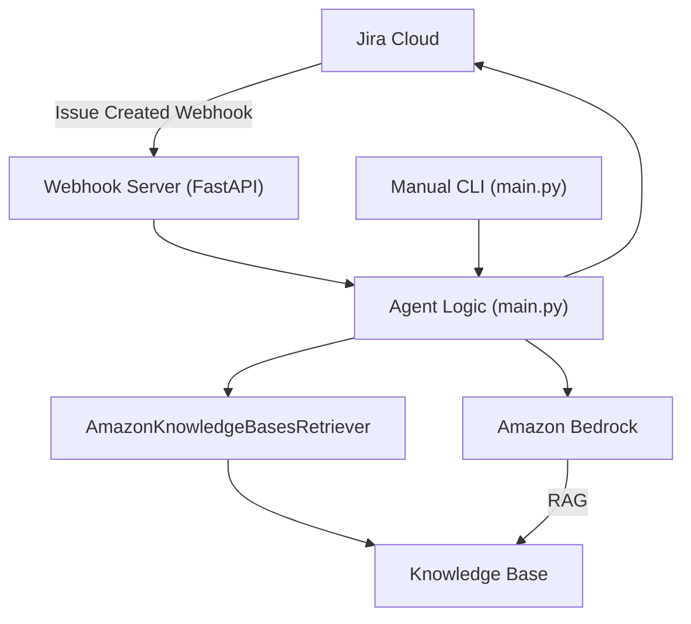
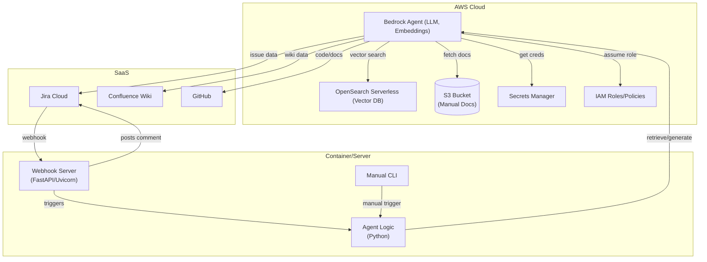
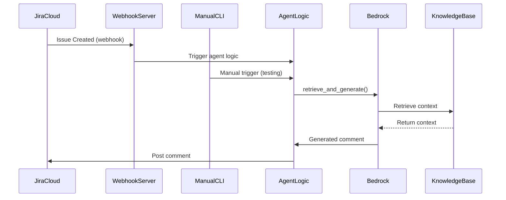

### Start the Webhook Server Locally

To start the webhook server locally for development/testing:

```bash
uvicorn webhook_server:app --host 0.0.0.0 --port 8000
```

You can access the FastAPI docs at: http://localhost:8000/docs

### Manually Test the Webhook Endpoint

You can manually test the webhook endpoint using curl:

```bash
curl -X POST http://localhost:8000/webhook/jira \
  -H "Content-Type: application/json" \
  -d '{"issue": {"key": "ABC-123"}, "webhookEvent": "jira:issue_created"}'
```

You should receive a JSON response indicating the request was accepted.
# JiraBot: Bedrock RAG-Powered JIRA Comment Assistant


## Overview
JiraBot is automatically triggered by Jira webhooks when a new ticket is created. The webhook server receives the event, runs the agent logic (main.py), and posts a generated comment to the ticket.

**Agent Logic (main.py) is used in two ways:**
- **Automation:** Invoked by the webhook server for production ticket processing.
- **Manual/Testing:** Can be run directly from the CLI for development and testing.

JiraBot leverages AWS Bedrock, a unified knowledge base (RAG), and JIRA APIs to generate high-quality, context-aware comments for JIRA tickets. It integrates data from Confluence, JIRA, GitHub, and S3, using vector search and LLMs for retrieval-augmented generation.

## Features
- Unified knowledge base (vector DB) with Wiki, JIRA, GitHub, and S3 sources
- Retrieval-augmented generation (RAG) using AWS Bedrock
- Automated JIRA comment drafting and posting
- Source citation in generated comments
- Modular, extensible Python codebase

## Keeping the Vector DB Up-to-Date (Syncing Knowledge Sources)

The project includes a unified sync pipeline to ensure the vector DB always reflects the latest content from Confluence Wiki, Jira, and GitHub:

### Sync Rules (applied to all sources)
1. **Automated Sync:** All sources (Wiki, Jira, GitHub) are fetched and updated on a schedule or manually.
2. **Obsolete/Deprecated/Archived Detection:**
  - **Wiki:** Pages with titles, labels, or content containing "obsolete", "deprecated", or "archived" are excluded from the vector DB.
  - **Jira:** Only issues with status "Closed" and resolution "Solved" are included.
  - **GitHub:** Only code files (not issues/PRs) are synced; you may filter by file extension or path.
3. **Change Detection:** Only new or updated items (by version, timestamp, or commit) are re-indexed to minimize unnecessary updates.
4. **Deletion/Removal Handling:**
  - **Wiki:** Pages deleted or marked obsolete in Confluence are removed from the vector DB.
  - **Jira:** Issues that are no longer "Closed/Solved" are removed from the vector DB.
  - **GitHub:** Files deleted from the repo are removed from the vector DB.

### Automated & Manual Sync
- **Automated Nightly Sync:** A central script (`nightly_sync.py`) runs all sync pipelines (Wiki, Jira, GitHub) on a schedule using GitHub Actions (GHA) or any scheduler. This keeps the KB up-to-date with all sources.
- **Manual/Selective Sync:** The same script and GHA workflow can be manually triggered to sync only selected sources (Wiki, Jira, GitHub) as needed.

### Individual Sync Scripts
- `jirabot/wiki_sync.py` — Syncs Confluence Wiki pages to the KB (run with: `python jirabot/wiki_sync.py <SPACEKEY>`)
- `jirabot/jira_sync.py` — Syncs Jira issues to the KB (run with: `python jirabot/jira_sync.py <PROJECTKEY>`)
- `jirabot/github_sync.py` — Syncs GitHub issues/PRs to the KB (run with: `python jirabot/github_sync.py <ORG/REPO>`)

All scripts require appropriate API credentials and KB path via environment variables.

### GitHub Actions Workflow
- The workflow `.github/workflows/nightly-sync.yml` runs nightly by default, syncing all three sources.
- You can also manually trigger the workflow and select which sources to sync (Wiki, Jira, GitHub) via the GHA UI.

### Example: Manual Sync
To sync only Jira and GitHub (not Wiki) via CLI:
```bash
python nightly_sync.py --jira --github
```

To sync only Wiki via GHA, use the workflow dispatch UI and uncheck Jira and GitHub.

### Environment Variables
Set the following as secrets or environment variables as needed:
- `WIKI_SPACE`, `JIRA_PROJECT`, `GITHUB_REPO`
- `CONFLUENCE_API_URL`, `CONFLUENCE_USER`, `CONFLUENCE_TOKEN`
- `JIRA_API_URL`, `JIRA_USER`, `JIRA_TOKEN`
- `GITHUB_TOKEN`
- `VECTOR_KB_PATH` (optional, default: `./kb_data/sample_kb.json`)


## Architecture Diagram




## Architecture Diagram



---

## Flow Diagram



## Architecture
- **Python**: Orchestrates retrieval, generation, and JIRA API calls
- **AWS Bedrock**: Embedding, vector search, and LLM inference
- **Terraform**: Infrastructure as code for KB, data sources, IAM


## Setup & Deployment
1. Clone the repo
2. Install Python dependencies: `pip install -r requirements.txt`
3. (Optional for local run) Install FastAPI and Uvicorn: `pip install fastapi uvicorn`
4. Configure AWS credentials and JIRA API access
5. Deploy infrastructure with Terraform (see kb.yaml, iam.yaml)
6. Set environment variables or edit `config.yaml` for runtime settings

### Run the Webhook Server (Production)
You can run the webhook server directly or with Docker:

**Directly:**
```bash
uvicorn webhook_server:app --host 0.0.0.0 --port 8000
```

**With Docker Compose:**
```bash
docker-compose up --build
```

### Connect Jira to the Agent
To enable automatic ticket processing, you must configure a Jira webhook:
1. Go to **Jira settings → System → Webhooks**
2. Click **Create a webhook**
3. Set the URL to: `http://<your-server>:8000/webhook/jira`
4. Under **Events**, select **Issue created** (and deselect others unless needed)
5. Save the webhook

Jira will now send a POST request to your webhook server every time a new ticket is created, and the agent will process it automatically.

## Usage

- **Production:** The agent logic (main.py) is triggered automatically by Jira webhooks via the webhook server. No manual script execution is required.
- **Manual/Testing:** For local/manual testing, you can run the agent logic directly from the CLI:
  ```bash
  python -m jirabot.main --ticket ABC-123
  ```
  - Use `--dry-run` to print the generated comment without posting to Jira.
  - This manual mode uses the same agent logic as automation and does not interfere with the webhook server or automated flow.
- Customize prompts, retrieval, and posting logic as needed.

  ## Local Demo

  Run this short demo to verify the local GitHub-to-Chroma query flow end to end:

  1. Activate the project virtual environment:
    ```bash
    source .venv/bin/activate
    ```
  2. Start Ollama and load the model used by the API layer:
    ```bash
    ollama run llama3
    ```
  3. Run a local semantic query against the Chroma collection:
    ```bash
    python scripts/chroma_query.py "rag agent"
    ```

  If you want a readable browser demo, start the server and open `http://localhost:8001/`:

  ```bash
  uvicorn scripts.rag_server:app --host 0.0.0.0 --port 8001 --reload
  ```

  Then use the page to run queries and read the answer, links, and retrieval scores as cards.

  If you want the raw API response instead, call `/query`:

  ```bash
  curl -X POST http://localhost:8001/query \
    -H "Content-Type: application/json" \
    -d '{"question":"rag agent"}'
  ```

  The query output includes retrieval metadata such as distance, a normalized confidence score, and a lightweight complexity estimate.

## Folder Structure
- `jiraComment.py` — Main script (to be modularized)
- `kb.yaml` — Bedrock KB and data source config
- `iam.yaml` — IAM policy for Bedrock, S3, OpenSearch, Secrets
- `requirements.txt` — Python dependencies
- `README.md` — This file

## Scripts moved for better organization

All Python scripts previously in the root directory are now in the scripts/ folder:

- chroma_query.py
- chroma_remove_duplicates.py
- local_chromadb_ingest.py
- nightly_sync.py
- rag_server.py
- run_webhook_server.py
- webhook_server.py

Update your usage accordingly, e.g.:

    python scripts/chroma_query.py "your query"

To resync GitHub changes into the local Chroma collection, rerun:

  python scripts/local_chromadb_ingest.py

The script now compares GitHub blob SHAs against stored Chroma metadata, so unchanged files are skipped and deleted files are removed from the collection.

Query responses also include retrieval metadata such as distance, a normalized confidence score, and a lightweight complexity estimate.

or

  uvicorn scripts.rag_server:app --host 0.0.0.0 --port 8001 --reload

---

If you have scripts or entry points in Docker, CI, or docs, update their paths to use scripts/.

## Roadmap
- Modularize codebase (src/ or jirabot/)
- Add tests and CI
- Add Dockerfile and deployment scripts

## License
[MIT License](LICENSE)
