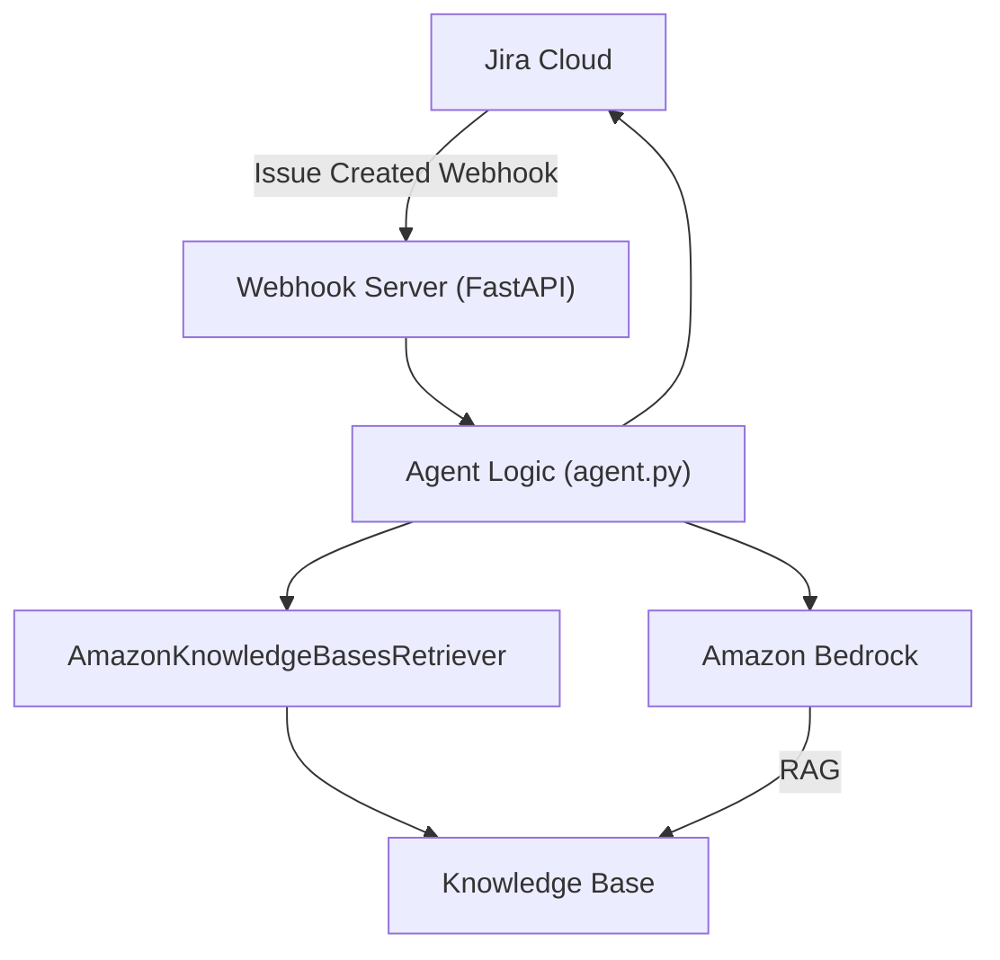
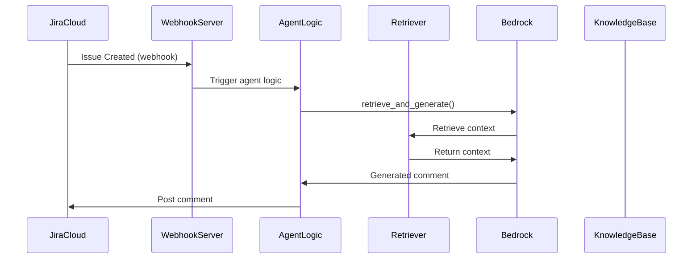

# JiraBot: Bedrock RAG-Powered JIRA Comment Assistant

## Overview
JiraBot is automatically triggered by Jira webhooks when a new ticket is created. The webhook server receives the event, runs the agent logic, and posts a generated comment to the ticket. No manual CLI/script is needed in production. (A CLI is available for local/manual runs.)

JiraBot leverages AWS Bedrock, a unified knowledge base (RAG), and JIRA APIs to generate high-quality, context-aware comments for JIRA tickets. It integrates data from Confluence, JIRA, GitHub, and S3, using vector search and LLMs for retrieval-augmented generation.

## Features
- Unified knowledge base (vector DB) with Wiki, JIRA, GitHub, and S3 sources
- Retrieval-augmented generation (RAG) using AWS Bedrock
- Automated JIRA comment drafting and posting
- Source citation in generated comments
- Modular, extensible Python codebase


## Architecture Diagram



## Flow Diagram



## Architecture
- **Python**: Orchestrates retrieval, generation, and JIRA API calls
- **AWS Bedrock**: Embedding, vector search, and LLM inference
- **Terraform**: Infrastructure as code for KB, data sources, IAM


## Setup & Deployment
1. Clone the repo
2. Install Python dependencies: `pip install -r requirements.txt`
3. (Optional for local run) Install FastAPI and Uvicorn: `pip install fastapi uvicorn`
4. Configure AWS credentials and JIRA API access
5. Deploy infrastructure with Terraform (see kb.yaml, iam.yaml)
6. Set environment variables or edit `config.yaml` for runtime settings

### Run the Webhook Server (Production)
You can run the webhook server directly or with Docker:

**Directly:**
```bash
uvicorn webhook_server:app --host 0.0.0.0 --port 8000
```

**With Docker Compose:**
```bash
docker-compose up --build
```

### Connect Jira to the Agent
1. Go to Jira settings → System → Webhooks
2. Add a webhook with the URL: `http://<your-server>:8000/webhook/jira`
3. Set the event: "Issue created"
4. The agent will be triggered automatically for every new ticket, generating and posting a comment.

## Usage
- In production, the agent is triggered automatically by Jira webhooks (see above).
- For local/manual testing, you can still run:
  ```bash
  python jiraComment.py --ticket ABC-123
  ```
- Customize prompts, retrieval, and posting logic as needed

## Folder Structure
- `jiraComment.py` — Main script (to be modularized)
- `kb.yaml` — Bedrock KB and data source config
- `iam.yaml` — IAM policy for Bedrock, S3, OpenSearch, Secrets
- `requirements.txt` — Python dependencies
- `README.md` — This file

## Roadmap
- Modularize codebase (src/ or jirabot/)
- Add tests and CI
- Add Dockerfile and deployment scripts

## License
[MIT License](LICENSE)
