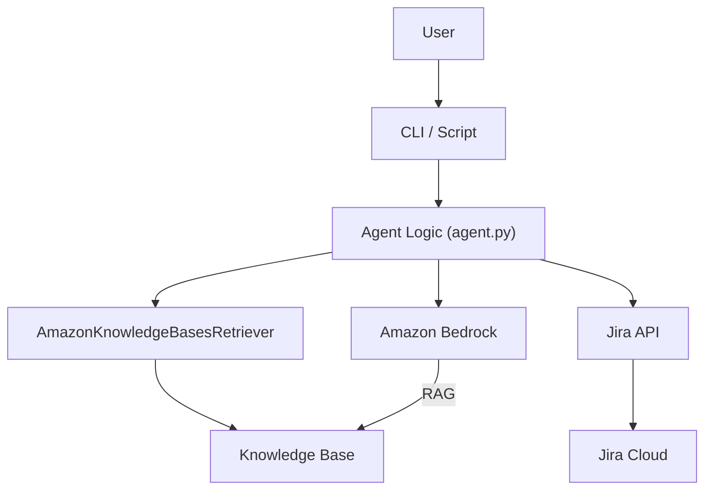
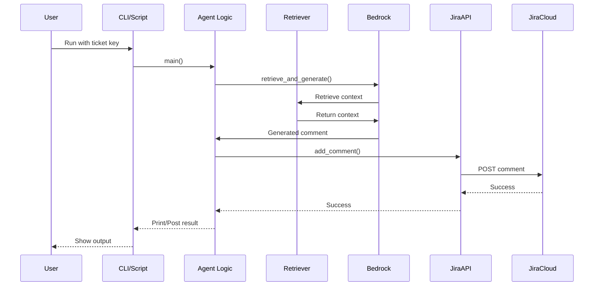

# JiraBot: Bedrock RAG-Powered JIRA Comment Assistant

## Overview
JiraBot leverages AWS Bedrock, a unified knowledge base (RAG), and JIRA APIs to generate high-quality, context-aware comments for JIRA tickets. It integrates data from Confluence, JIRA, GitHub, and S3, using vector search and LLMs for retrieval-augmented generation.

## Features
- Unified knowledge base (vector DB) with Wiki, JIRA, GitHub, and S3 sources
- Retrieval-augmented generation (RAG) using AWS Bedrock
- Automated JIRA comment drafting and posting
- Source citation in generated comments
- Modular, extensible Python codebase


## Architecture Diagram



## Flow Diagram



## Architecture
- **Python**: Orchestrates retrieval, generation, and JIRA API calls
- **AWS Bedrock**: Embedding, vector search, and LLM inference
- **Terraform**: Infrastructure as code for KB, data sources, IAM

## Setup
1. Clone the repo
2. Install Python dependencies: `pip install -r requirements.txt`
3. Configure AWS credentials and JIRA API access
4. Deploy infrastructure with Terraform (see kb.yaml, iam.yaml)
5. Set environment variables or edit `config.yaml` for runtime settings

## Usage
- Run the main script to generate and post JIRA comments:
  ```bash
  python jiraComment.py --ticket ABC-123
  ```
- Customize prompts, retrieval, and posting logic as needed

## Folder Structure
- `jiraComment.py` — Main script (to be modularized)
- `kb.yaml` — Bedrock KB and data source config
- `iam.yaml` — IAM policy for Bedrock, S3, OpenSearch, Secrets
- `requirements.txt` — Python dependencies
- `README.md` — This file

## Roadmap
- Modularize codebase (src/ or jirabot/)
- Add tests and CI
- Add Dockerfile and deployment scripts

## License
[MIT License](LICENSE)
